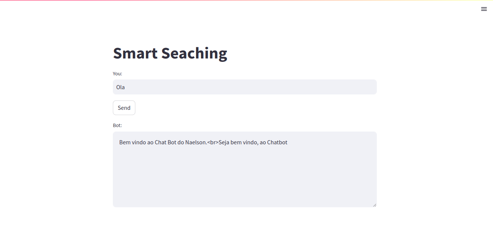
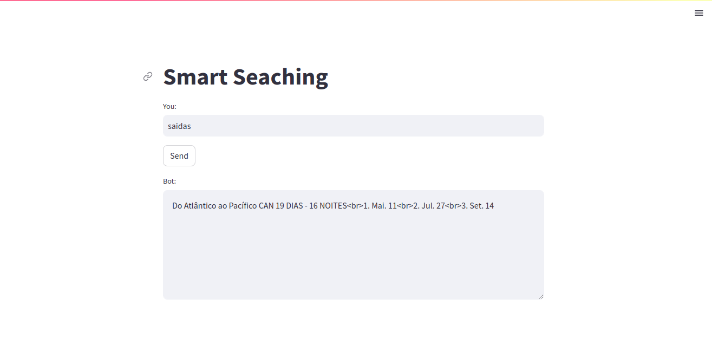
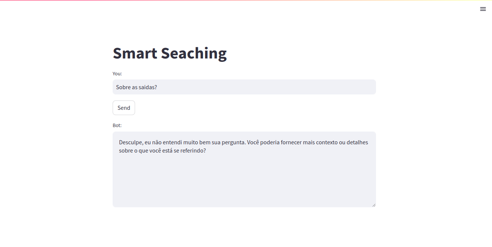
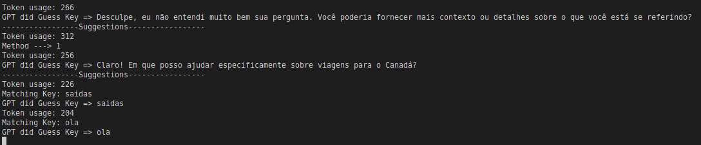

###### Este pequeno sistema nasceu da ideia de aprendizagem, na tentativa de criar algo semelhante ao 'lanchain', reduzindo o tempo de espera e colocando em prática conhecimentos de embedding. Essa é uma ideia prática que levou certo tempo para ser desenvolvida, mas que resultou em novos conhecimentos e uma compreensão mais profunda sobre LLM, NTK, NLP e todas as suas técnicas. 

Installs

```
  imports
  python3
```

Sobre o documento document.json
Funciona assim. 
A chave, index, key, seja o que prefere chamar. a Pai cono a baixo de nome ola. Ela pode ser custom. As demais chaves como
field_contexto,
field_titulo,
field_lista
devem ser a mesma. 

```
    "ola": {
        "field_contexto": "Bem vindo, é a frase mais preferida de quando se inicia uma conversa.",
        "field_titulo": "Bem vindo ao Chat Bot do Naelson.",
        "field_lista": [
            "Seja bem vindo, ao Chatbot"
        ]
    }
```

<br>
<br>

<br>
<br>
<br>

### Perfil do LinkedIn
[](https://www.linkedin.com/in/devnaelson/)
