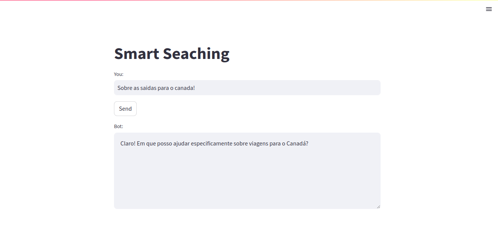

###### Este pequeno sistema nasceu da ideia de aprendizagem, na tentativa de criar algo semelhante ao 'lanchain', reduzindo o tempo de espera e colocando em prática conhecimentos tecnicos de embedding, custer, similaridades entre outras.

Essa é uma ideia prática que levou certo tempo para ser desenvolvida, mas que resultou em novos conhecimentos e uma compreensão mais profunda sobre LLM, NTK, NLP e todas as suas técnicas, estou deixando como portifólio, mas também, vou ta compartilhando com a galera.

Installs
Em tools.py adiciona a sua chave openai.api_key = "" 
```
  imports
  python3
```

Sobre o documento document.json
Funciona assim. 
A chave, index, key, seja o que prefere chamar. a Pai cono a baixo de nome ola. Ela pode ser custom. As demais chaves como
field_contexto,
field_titulo,
field_lista
devem ser a mesma. 

```
    "ola": {
        "field_contexto": "Bem vindo, é a frase mais preferida de quando se inicia uma conversa.",
        "field_titulo": "Bem vindo ao Chat Bot do Naelson.",
        "field_lista": [
            "Seja bem vindo, ao Chatbot"
        ]
    }
```

<br>
- Como visto na imagem acima e na estrutura do JSON, ele deu match exibiu o titulo e um itém da lista.
  
<br>
- Uma das coisas legais, e que eu tentei manter, caso ele encontre a chave pai, ele da um display exatamente o que contém no array.
  
<br>
- Aqui cmo você pode ver eu fiz uma pesquisa sem contexto, a resposta dada a mim.
  
<br>
- Logo em seguida, eu adicionei mais contexto para da match na similaridade do campo field_contexto.
  
<br>
- Uma das enorme vatagem desse pequeno prototipo, é a economia do token, onde o mesmo unsado o langchain, gasta 3x mais.

### Perfil do LinkedIn
[](https://www.linkedin.com/in/devnaelson/)
