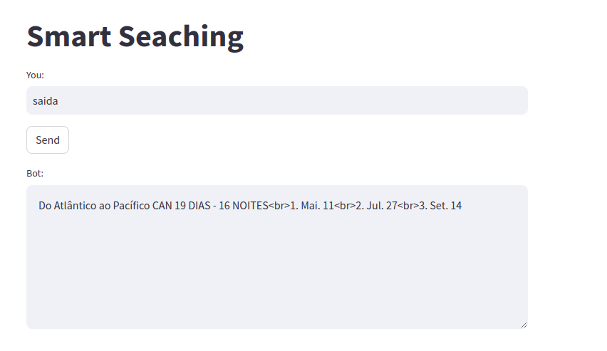

###### Este pequeno sistema nasceu da ideia de aprendizagem, na tentativa de criar algo semelhante ao 'lanchain', reduzindo o tempo de espera e colocando em prática conhecimentos de embedding. Essa é uma ideia prática que levou certo tempo para ser desenvolvida, mas que resultou em novos conhecimentos e uma compreensão mais profunda sobre LLM, NTK, NLP e todas as suas técnicas. 

Installs

```
  imports
  python3
```


<br>
<br>

### Perfil do LinkedIn
[](https://www.linkedin.com/in/devnaelson/)
